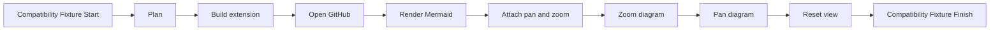

# GitHub Mermaid compatibility fixture

This diagram is used by the scheduled browser compatibility test.

```mermaid
flowchart LR
    start[Compatibility Fixture Start] --> plan[Plan]
    plan --> build[Build extension]
    build --> open[Open GitHub]
    open --> render[Render Mermaid]
    render --> attach[Attach pan and zoom]
    attach --> zoom[Zoom diagram]
    zoom --> pan[Pan diagram]
    pan --> reset[Reset view]
    reset --> finish[Compatibility Fixture Finish]
```
